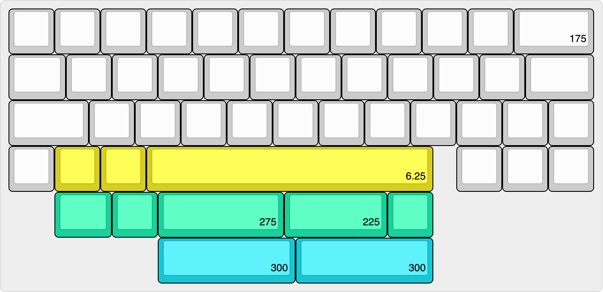

# MB-44 v2

## Introduction

The MB-44 is a 12.75u layout 0.5u blocker separating spacebars from the arrow cluster similar to typical 65% layout.

Version 2 is a refresh of the original project that ran in April 2021, updating the case and PCB design.

This repository includes resources for the PCB mainboard and switch plate for the MB-44 v2. Assets of the case are also available for render purposes only and are not intended for manufacturing.

## Improvements

The following are improvements made to the original MB-44:

- Effective key height (EKH) reduced from 24.6mm to 22.2mm
- PCB updated to STM32 from ATmega MCU.
- Updated from C3 variant of the Unified Daughter Board (UDB) to the S1 variant.
- PCB and bottom case cavity reduced to eliminate unnecessary reverberations.
- Brass interior cover plate and accent weight to provide some sound dampening and cover for the UDB cable.
- Plate mounting uses Geon's tadpoles.

## Keyboard Layout

## Information

Please note that users that would intend to use the resources in this repository is shall review all files prior to any sort of production or manufacturing. The author of this repository does not provide warranty and has no liability for how these resources are used.

Vial firmware has been compiled for for the PCB included in this repository. Firmware source is available [here](https://github.com/vial-kb/vial-qmk/tree/vial/keyboards/melonbred/mb44v2).
